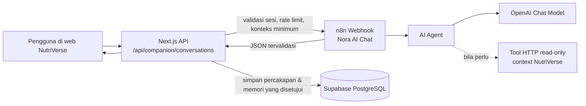

# Workflow n8n untuk Nora AI di NutriVerse

Dokumen ini adalah rancangan implementasi Nora sebagai AI Companion. Saat ini
halaman `/companion` dan endpoint `POST /api/companion/conversations` sudah ada,
tetapi jawabannya masih dibuat oleh aturan lokal. Workflow ini mengganti bagian
pembuat jawaban dengan AI tanpa mengubah tampilan chat, autentikasi pengguna,
perhitungan XP, atau data GPS.

## Prinsip arsitektur



Browser **tidak** pernah memanggil n8n atau OpenAI secara langsung. Browser hanya
berkomunikasi dengan API NutriVerse yang sudah memiliki sesi pengguna. Dengan
demikian API key, webhook URL, dan data kesehatan tidak terekspos ke frontend.

## Yang dibutuhkan

| Kebutuhan | Fungsi | Lokasi penyimpanan |
| --- | --- | --- |
| Akun n8n Cloud atau n8n self-hosted | Menjalankan workflow | n8n |
| OpenAI API key berbasis Project | Kredensial model AI | Credential n8n, bukan frontend |
| URL produksi NutriVerse ber-HTTPS | n8n mengakses tool backend | Konfigurasi n8n |
| `N8N_NORA_WEBHOOK_URL` | URL webhook n8n yang dipanggil backend | environment backend |
| `N8N_NORA_SHARED_SECRET` | Rahasia server-ke-server | environment backend dan secret n8n |
| Persetujuan pengguna untuk AI Companion | Mengatur pemrosesan data kesehatan | pengaturan aplikasi |
| Kebijakan privasi dan batas medis | Mencegah AI memberi diagnosis/resep | prompt dan backend |

Untuk MVP tidak diperlukan Supabase service-role key di n8n. Backend NutriVerse
tetap membaca dan menulis database menggunakan Prisma. Ini lebih aman karena
n8n tidak diberi akses langsung untuk mengubah XP, Health Point, aktivitas GPS,
atau profil pengguna.

## Workflow utama: `NutriVerse – Nora AI Chat`

Gunakan **Webhook**, bukan `When chat message received`. Chat Trigger n8n cocok
untuk widget chat bawaan n8n; aplikasi NutriVerse sudah memiliki tampilan chat
sendiri dan harus mempertahankan sesi autentikasinya.

### Node yang dipasang

1. **Webhook**
   - Method: `POST`
   - Path: `nutriverse/nora/chat`
   - Response: `Using Respond to Webhook node`
   - Hanya backend NutriVerse yang boleh memanggil URL ini.

2. **IF – Verify shared secret**
   - Bandingkan header `x-nutriverse-agent-secret` dengan secret n8n.
   - Bila tidak cocok, arahkan ke `Respond to Webhook` dengan HTTP `401`.
   - Untuk produksi, gunakan HMAC bertanda waktu agar request tidak dapat diulang.

3. **Edit Fields (Set) – Normalize request**
   - Pertahankan hanya: `requestId`, `userId`, `message`, `companionName`,
     `profile`, `progress`, `recentMessages`, dan `locale`.
   - Jangan teruskan email, token Supabase, koordinat GPS mentah, atau data
     sensitif yang tidak diperlukan untuk menjawab.

4. **AI Agent**
   - Prompt: gunakan `message` pengguna dan konteks minimum dari node Set.
   - Model: sambungkan ke node **OpenAI Chat Model**.
   - Tool: awalnya kosong atau hanya tool baca-saja. Jangan memberi akses tulis
     ke XP, HP, reward, challenge, atau aktivitas.

5. **OpenAI Chat Model**
   - Buat credential OpenAI baru di n8n dan masukkan Project API key.
   - Pilih model teks yang sesuai anggaran di credential/node n8n.
   - API key hanya berada di Credential n8n, tidak pernah pada `.env` frontend.

6. **Structured Output Parser**
   - Sambungkan ke port `Output Parser` pada AI Agent.
   - Paksa respons AI menjadi JSON sesuai kontrak di bawah.

7. **Code atau Edit Fields – Validate output**
   - Batasi `reply` maksimal 1.500 karakter.
   - Bila parser gagal, gunakan jawaban fallback aman dan kosongkan memory.

8. **Respond to Webhook**
   - HTTP `200` dan body JSON tervalidasi.

### System prompt Nora

Masukkan prompt berikut pada AI Agent. Nilai dalam kurung siku berasal dari node
Set, bukan dari instruksi pengguna.

```text
Kamu adalah {{companionName}}, pendamping kebiasaan sehat di NutriVerse.
Gunakan Bahasa Indonesia yang hangat, singkat, dan praktis.

Konteks pengguna yang telah diverifikasi aplikasi:
{{JSON.stringify(progress)}}

Aturan wajib:
- Berikan dukungan kebiasaan, penjelasan progres, dan langkah kecil yang realistis.
- Jangan membuat diagnosis, resep, dosis obat, atau kepastian medis.
- Untuk gejala darurat, keinginan menyakiti diri, atau kondisi yang terasa gawat,
  sarankan menghubungi tenaga medis/layanan darurat setempat segera.
- Jangan mengklaim XP, HP, challenge, atau aktivitas sudah berubah. Hanya backend
  NutriVerse yang boleh mengubahnya.
- Jangan meminta kata sandi, token, alamat lengkap, atau koordinat GPS mentah.
- Bila konteks tidak cukup, katakan apa yang belum diketahui dan ajukan satu
  pertanyaan lanjutan.
- Jawab maksimal 3 paragraf pendek.

Kembalikan JSON yang sesuai schema. Jangan menambahkan Markdown di luar JSON.
```

### Kontrak request backend → n8n

```json
{
  "requestId": "uuid-per-request",
  "userId": "uuid-internal-nutriverse",
  "message": "Bagaimana progresku hari ini?",
  "companionName": "Nora",
  "locale": "id-ID",
  "profile": {
    "goals": ["lebih aktif"],
    "dietaryNotes": []
  },
  "progress": {
    "healthPulse": 72.4,
    "waterMlToday": 1100,
    "walkingKmToday": 1.8,
    "dailyChallenge": "Jalan 3 km"
  },
  "recentMessages": [
    { "role": "user", "content": "Halo" },
    { "role": "assistant", "content": "Halo, ada yang bisa kubantu?" }
  ]
}
```

### Kontrak respons n8n → backend

Konfigurasikan Structured Output Parser dengan schema ini:

```json
{
  "type": "object",
  "additionalProperties": false,
  "required": ["reply", "safety", "memoryCandidates"],
  "properties": {
    "reply": { "type": "string", "maxLength": 1500 },
    "safety": {
      "type": "string",
      "enum": ["normal", "medical_caution", "urgent_support"]
    },
    "memoryCandidates": {
      "type": "array",
      "maxItems": 3,
      "items": {
        "type": "object",
        "additionalProperties": false,
        "required": ["key", "value", "category", "importance"],
        "properties": {
          "key": { "type": "string", "maxLength": 80 },
          "value": { "type": "string", "maxLength": 300 },
          "category": { "type": "string", "maxLength": 40 },
          "importance": { "type": "integer", "minimum": 1, "maximum": 3 }
        }
      }
    }
  }
}
```

Contoh respons:

```json
{
  "reply": "Kamu sudah berjalan 1,8 km hari ini. Jika nyaman, satu putaran pendek lagi bisa membawamu lebih dekat ke target 3 km.",
  "safety": "normal",
  "memoryCandidates": []
}
```

## Tool AI yang aman

Tambahkan tool satu per satu setelah chat dasar stabil. Gunakan **HTTP Request Tool**
atau workflow tool n8n untuk memanggil endpoint internal NutriVerse yang telah
diautentikasi dengan secret terpisah.

| Tool | Aksi | Status MVP |
| --- | --- | --- |
| `get_progress_overview` | Membaca Health Pulse, target dan challenge | Boleh |
| `get_recent_activity_summary` | Membaca ringkasan aktivitas terverifikasi | Boleh |
| `get_nutrition_summary` | Membaca total kalori, protein, air | Boleh |
| `get_saved_memories` | Membaca memori pendamping yang disetujui | Boleh |
| `save_memory_candidate` | Mengusulkan memori, backend tetap memvalidasi | Tahap 2 |
| `create_reminder_draft` | Membuat draf pengingat, perlu konfirmasi pengguna | Tahap 2 |
| `grant_xp`, `change_hp`, `verify_activity` | Mengubah sistem kompetitif | Dilarang |

AI tidak boleh memiliki kredensial database yang dapat menulis. Semua perubahan
kompetitif tetap melalui service backend yang sekarang sudah menjalankan validasi
anti-cheat dan aturan ekonomi.

## Perubahan backend yang nantinya diperlukan

Saat credential n8n sudah siap, implementasinya cukup berfokus pada backend dan
tidak perlu mengubah struktur/tema frontend:

1. `POST /api/companion/conversations` tetap menjadi endpoint yang dipanggil UI.
2. Endpoint tersebut memvalidasi sesi, rate limit, dan isi pesan seperti sekarang.
3. Backend mengambil `buildProgressOverview`, preferensi pendamping, memori yang
   disetujui, serta 10–12 pesan terakhir.
4. Backend memanggil `N8N_NORA_WEBHOOK_URL` dengan secret/HMAC dan timeout 15 detik.
5. Backend memvalidasi JSON respons n8n sebelum menyimpan pesan AI ke
   `CompanionConversation`.
6. `CompanionMemory` hanya di-upsert setelah kandidat memory lolos aturan backend
   dan, untuk data sensitif, persetujuan pengguna.
7. Jika n8n/OpenAI gagal atau timeout, backend mengembalikan fallback aman sehingga
   chat web tidak rusak.

Tambahkan environment variable berikut pada server NutriVerse, bukan browser:

```dotenv
N8N_NORA_WEBHOOK_URL=https://<workspace>.app.n8n.cloud/webhook/nutriverse/nora/chat
N8N_NORA_SHARED_SECRET=ganti-dengan-rahasia-panjang-acak
N8N_NORA_TIMEOUT_MS=15000
```

## Workflow tambahan setelah chat stabil

### 1. Daily insight

`Schedule Trigger (pagi) → HTTP Request ke endpoint internal NutriVerse → AI Agent → HTTP Request simpan insight → Notification`

Jalankan hanya untuk pengguna yang mengaktifkan `morningBriefEnabled`. Insight
bersifat saran, bukan pemberian XP.

### 2. Weekly letter

`Schedule Trigger (mingguan) → ambil ringkasan 7 hari → AI Agent → validasi JSON → simpan WeeklyLetterArchive → notifikasi`

Gunakan satu workflow batch dan jangan membuat satu API call per data mentah.

### 3. Alert operasional

`Error Trigger → kirim notifikasi admin/email` untuk kegagalan workflow, timeout,
atau respons AI yang tidak sesuai schema. Jangan memasukkan pesan pengguna penuh
ke notifikasi error.

## Cara setup di n8n Cloud

1. Buat workflow baru bernama `NutriVerse – Nora AI Chat`.
2. Tambahkan node sesuai urutan pada bagian *Workflow utama*.
3. Buat credential **OpenAI** dan masukkan Project API key di n8n.
4. Buat secret untuk validasi request server-ke-server.
5. Salin **Production Webhook URL**; jangan gunakan Test URL untuk aplikasi web.
6. Aktifkan workflow.
7. Masukkan URL dan secret ke environment backend NutriVerse.
8. Uji dari n8n dengan payload contoh, lalu uji dari endpoint backend yang sudah
   diautentikasi.

## Checklist sebelum produksi

- [ ] API key OpenAI hanya tersimpan sebagai credential/secret server.
- [ ] Webhook menolak request tanpa secret atau HMAC yang valid.
- [ ] CORS tidak digunakan sebagai satu-satunya perlindungan.
- [ ] Backend memiliki timeout, retry terbatas, dan fallback.
- [ ] AI tidak memiliki akses tulis langsung ke Supabase/Prisma.
- [ ] Respons AI diparse sebagai JSON dan divalidasi di backend.
- [ ] Terdapat batas panjang pesan, rate limit, dan logging request ID.
- [ ] Ada kebijakan untuk pertanyaan medis/darurat dan persetujuan data.
- [ ] Workflow memakai Production URL dan sudah aktif.

## Referensi

- [n8n AI Agent](https://docs.n8n.io/integrations/builtin/cluster-nodes/root-nodes/n8n-nodes-langchain.agent/)
- [n8n Webhook](https://docs.n8n.io/integrations/builtin/core-nodes/n8n-nodes-base.webhook/)
- [n8n Respond to Webhook](https://docs.n8n.io/integrations/builtin/core-nodes/n8n-nodes-base.respondtowebhook/)
- [OpenAI API quickstart](https://platform.openai.com/docs/quickstart/make-your-first-api-request)
- [OpenAI API data controls](https://platform.openai.com/docs/models/default-usage-policies-by-endpoint)
